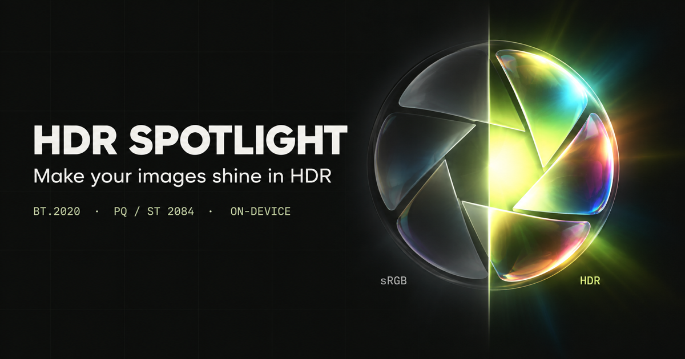

# HDR Spotlight



A local HDR image workbench built with Angular 22 and Tailwind CSS 4. Upload, drop or paste PNG, JPEG, WebP or SVG artwork, adjust exposure and export a PQ-encoded BT.2020 image. No files are uploaded to a server.

Website: [hdrspotlight.com](https://hdrspotlight.com/)

## Development

```sh
pnpm install --frozen-lockfile
pnpm start
```

Open http://localhost:4200. Run the full quality check:

```sh
pnpm check
```

This checks formatting, runs ESLint and unit tests, and builds the production application. Use `pnpm test:ci` to run the tests separately.

## Image converter

The `/convert` route exports PNG, JPEG, WebP, BMP and ICO locally. JPEG and WebP
have adjustable quality; other outputs are lossless or uncompressed. Optional resizing
supports linked dimensions. ICO exports one size (16–256 px) with transparent padding.
JPEG and BMP composite transparency onto a selectable background.

Inputs include PNG, JPEG, WebP, GIF, BMP, ICO, AVIF and SVG, subject to browser decoding
support. Limits are 32 MB, 16 megapixels and 16,384 px per side. Output is static SDR;
animation, source metadata and HDR profiles are not retained. SVG is rasterized.

Native canvas encoding is used when available. WebP falls back to the lazily loaded
`@jsquash/webp` encoder; its WASM assets are served locally from `/assets/codecs/`
and cached on demand by the service worker. No third-party image service is used.

## Docker

Build and run the production SSR image locally:

```sh
docker build -t hdr-spotlight .
docker run --rm -p 4200:4200 hdr-spotlight
```

## Structure

```text
src/
  app/
    app.component.*               # Root application shell
    app.config*.ts                # Browser hydration and server rendering providers
    app.routes*.ts                # Browser and prerender route configuration
    core/theme/                   # Theme preference, persistence and system sync
    features/bench/
      bench.component.*           # Workspace composition and store bindings
      components/
        source-upload/            # File selection, drag/drop and clipboard lifecycle
        display-indicator/        # HDR capability detection and media-query lifecycle
        light-controls/           # Settings group composition, reset and encode actions
          exposure-controls/      # Presets, highlight boost and PQ luminance ruler
          glow-mask-controls/     # Glow mode and threshold
          output-controls/        # Background, transparency and dimensions
        image-comparison/         # Original / actual HDR file and preview backdrop
        export-results/           # Downloads and measured luminance statistics
      services/
        bench-store.service.ts    # Signals, async lifecycle, cancellation, URL ownership
        image-encoder.service.ts  # Decode, fit/composite, worker and canvas export
      engine/
        color.ts                  # Color mathematics and interpolated PQ lookup
        encoder.ts                # Input validation, pixel transformation and statistics
        encoder.worker.ts         # Pixel transformation off the UI thread
        encoder-worker.models.ts  # Shared worker request, result and error contracts
        icc.ts                    # ICC v4.4 profile with CICP
        container.ts              # Container validation and HDR metadata replacement
      models/                     # Typed contracts, settings and defaults
    features/convert/             # Converter page, state, codecs and container tests
    shared/ui/
      icon/                       # Shared SVG icon component
      theme-switcher/             # System, light and dark theme control
    styles/                       # Fonts and shared design-system styles
  assets/fonts/                   # Self-hosted fonts with their OFL 1.1 licenses
  index.html                      # Document metadata and pre-hydration theme bootstrap
  main*.ts                        # Browser and server application entry points
  server.ts                       # Express SSR server
  styles.css                      # Tailwind entry point and design tokens
public/
  Rec2020-PQ.icc                  # Downloadable BT.2020 PQ color profile
  favicon.*                       # Browser icons
  robots.txt                      # Crawler rules and sitemap location
  sitemap.xml                     # Public route index
LICENSE                           # MIT license for the project source code
```

Presentation components use signal inputs/outputs and OnPush. Settings groups accept narrow inputs and emit typed changes; only the workspace writes to the store. The workspace provides its own store, while the root theme service owns appearance preference and browser synchronization. Browser APIs initialize after rendering, so SSR and hydration work. The store owns and revokes image object URLs, ignores stale uploads and cancels processing on settings changes or destruction. A yielding strip-based fallback is available when workers are not supported.

## Image behavior

- Pipeline: sRGB canvas decode/compositing → linear sRGB → selected highlight boost → linear BT.2020 → absolute luminance anchored at 203 nits → 8-bit ST 2084 PQ with ordered dithering.
- JPEG includes an ICC v4.4 profile with CICP `9 / 16 / 0 / 1`. It uses the browser's highest-quality JPEG encoding; exact chroma subsampling is browser-dependent.
- PNG carries a `cICP` chunk. Enable **Preserve transparency** to retain the alpha channel of the rasterized source and transparent padding; the preview, primary download and statistics then refer to PNG. JPEG always composites the source onto the selected background before HDR encoding. With the switch off, both outputs are opaque. Transparent-image coverage is weighted by opacity; fully invisible pixels do not affect peak luminance.
- Choose a square preset, original dimensions, or a custom width and height (up to 16 megapixels and 16,384 pixels per side). **Keep aspect ratio** is on by default and fits the artwork inside the canvas with padding. Turn it off to stretch the image to the exact canvas dimensions. The same sizing applies to PNG, JPEG and the JPEG quality preview.
- Inputs are limited to 32 MB, 16 megapixels and 16,384 pixels per side. Output presets run through 3840 × 3840.
- Input color is normalized through an sRGB canvas. This is not a wide-gamut preservation workflow or a gain-map encoder.
- HDR appearance depends on the display, browser, color management and power settings. The preview uses the actual exported file, without simulated CSS brightness. The Light/Dark preview backdrop does not change output pixels.

## Engine details

- Pixel encoding uses an approximately 64 KiB PQ lookup table with denser samples near black and interpolation between samples. The darkest values use the exact formula. The exact PQ functions remain available for reference calculations. In `whites` mode, all 256 possible mask weights are calculated once per transform.
- Highlight masks use source sRGB values; exposure is applied in linear light. Zero feather produces a hard threshold, including pixels exactly on the threshold. The 4 × 4 Bayer dither offsets are centered on zero and shared across RGB channels.
- Before modifying pixels, the engine rejects empty or invalid dimensions, mismatched RGBA buffers, non-finite exposure, threshold/feather outside `0..1`, unknown modes and invalid boolean options. Exposure must also produce a finite luminance.
- PNG metadata insertion replaces existing `cICP` chunks, so repeated calls do not add duplicates. JPEG replaces APP1/APP2 metadata with the supplied ICC profile and preserves the scan bytes. Container checks validate signatures, segment/chunk boundaries and required end markers; they do not decode compressed pixels or verify CRCs of retained PNG chunks.

Unit tests cover PQ accuracy and monotonicity, hard thresholds, invalid inputs, dither averages, coverage/clipping, ICC fields, JPEG segment splitting, repeated metadata replacement, truncated containers, PNG CRC generation, asynchronous store races, settings propagation/reset, and browser-listener cleanup. PQ lookup tests compare linear and logarithmic samples against the exact formula with an error limit of 0.005 of an 8-bit code value before rounding; values near rounding boundaries can still differ by one output code.

Manual browser checks have also exercised Canvas PNG/JPEG export and decoding, alpha preservation and repeated metadata replacement. Pixel-transform benchmarks exclude Canvas work and file compression; their speedup is not an end-to-end export guarantee.

## License

The project source code is available under the [MIT License](LICENSE). Montserrat and JetBrains Mono are distributed under the SIL Open Font License 1.1; their license texts are included alongside the font files.
